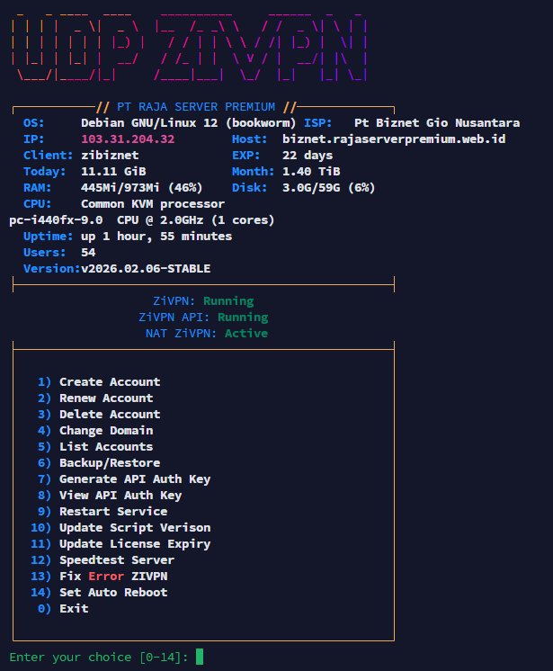

<p align="center">
  
</p>

<h1 align="center">🚀 ZiVPN UDP Server</h1>

UDP server installation for **ZiVPN Tunnel (UDP)** VPN application.

Server binary available for **Linux amd64**, **arm**, and **arm64** with automatic architecture detection.

---

## 🧠 Features
- Auto detect VPS architecture (amd64 / arm / arm64)  
- Auto download & install latest UDP binary  
- Auto setup **systemd service** 
- Auto configure **UFW firewall** & NAT  
- Auto apply default "zi" config  
- Support for **Ubuntu 20.04 / 22.04 / 24.04** and **Debian 10 / 11 / 12**  
- Optional Dual SC or ZiVPN Only mode menu  
- Auto alias command `menu` for `/usr/local/bin/zivpn-manager`  

---

## 📦 Installation Menu

```bash
apt update -y && apt install --reinstall wget curl -y && wget -q https://raw.githubusercontent.com/ziflazz-sketch/zivpn/main/install.sh -O /usr/local/bin/install.sh && chmod +x /usr/local/bin/install.sh && /usr/local/bin/install.sh
```

### ⚡ Quick Install UDP AMD

```bash
wget -O zi.sh https://raw.githubusercontent.com/zahidbd2/udp-zivpn/main/zi.sh; sudo chmod +x zi.sh; sudo ./zi.sh
```

### ⚡ Quick Install UDP ARM

```bash
bash <(curl -fsSL https://raw.githubusercontent.com/zahidbd2/udp-zivpn/main/zi2.sh)
```

> Installer akan otomatis:
> - Download binary terbaru sesuai arsitektur  
> - Setup systemd service `zivpn.service`  
> - Setup firewall UFW & NAT  
> - Set default password "zi"  
> - Membuat menu otomatis saat login  

---

## 🔧 Fix ZIVPN

```bash
wget -q https://raw.githubusercontent.com/ziflazz-sketch/zivpn/main/fix-zivpn.sh -O /usr/local/bin/fix-zivpn.sh && chmod +x /usr/local/bin/fix-zivpn.sh && /usr/local/bin/fix-zivpn.sh
```

> Script ini akan:
> - Memperbaiki service ZIVPN
> - Reset firewall & NAT
> - Membackup dan MeRestore Akun lama
> - Memastikan server aman

## 📦 Update Menu

```bash
wget -q https://raw.githubusercontent.com/ziflazz-sketch/zivpn/main/update.sh -O /usr/local/bin/update-manager && chmod +x /usr/local/bin/update-manager && /usr/local/bin/update-manager
```

> Installer akan otomatis:
> - Setup systemd service New `zivpn.service`  
> - Setup firewall UFW & NAT  
> - Set default password "zi"  
> - Membuat menu otomatis saat login  

---

## 🌐 Speedtest Server

Menu **12** di panel sekarang diarahkan ke file berikut:

```bash
wget -q https://raw.githubusercontent.com/ziflazz-sketch/zivpn/main/install_speedtest.sh -O /tmp/install_speedtest.sh && chmod +x /tmp/install_speedtest.sh && bash /tmp/install_speedtest.sh && speedtest --accept-license --accept-gdpr
```

Didesain untuk:
- Ubuntu **20.04 / 22.04 / 24.04**
- Debian **10 / 11 / 12**

Script akan membersihkan repo speedtest lama yang rusak lebih dulu, lalu memasang paket resmi Ookla yang sesuai.


## 🧼 Uninstall Menu

```bash
wget -q https://raw.githubusercontent.com/ziflazz-sketch/zivpn/main/uninstall.sh -O /usr/local/bin/uninstall-zivpn && chmod +x /usr/local/bin/uninstall-zivpn && /usr/local/bin/uninstall-zivpn
```

> Uninstall akan:
> - Stop dan disable systemd service  
> - Hapus binary `/usr/local/bin/zivpn`  
> - Hapus konfigurasi `/etc/zivpn/`  
> - Hapus NAT / firewall rules  

---

## 🖥 Supported Architecture

| Architecture | Binary |
|-------------|--------|
| **x86_64 (AMD64)** | udp-zivpn-linux-amd64 |
| **ARM 32-bit** | udp-zivpn-linux-arm |
| **ARM 64-bit (ARMv8)** | udp-zivpn-linux-arm64 |

---

## 📡 Default Configuration

| Setting | Value |
|---------|-------|
| Default Password | `zi` |
| Service Name | `zivpn.service` |
| Config File | `/etc/zivpn/config.json` |
| Binary Path | `/usr/local/bin/zivpn` |
| Firewall / NAT | UDP 6000-19999 → 5667 |
| Auto Menu Alias | `menu` → `/usr/local/bin/zivpn-manager` |

---

## 📱 Client Application

| Platform | Link |
|----------|------|
| Android | [ZiVPN Tunnel](https://play.google.com/store/apps/details?id=com.zi.zivpn) |

> App: **ZiVPN Tunnel**

---

## ⚙️ Systemd / Auto Restart

- Service dijalankan dengan:
```bash
systemctl enable zivpn.service
systemctl start zivpn.service
```
- Service akan **restart otomatis** jika mati
- Tunggu **network-online.target** sebelum start service → mencegah error UDP bind  

---

## 📞 Support

For custom build, business inquiry, reseller system, panel, or telegram bot please contact support.

---

### 🎉 Thank you for using **ZiVPN UDP Server**
